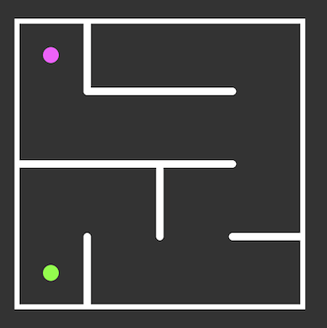
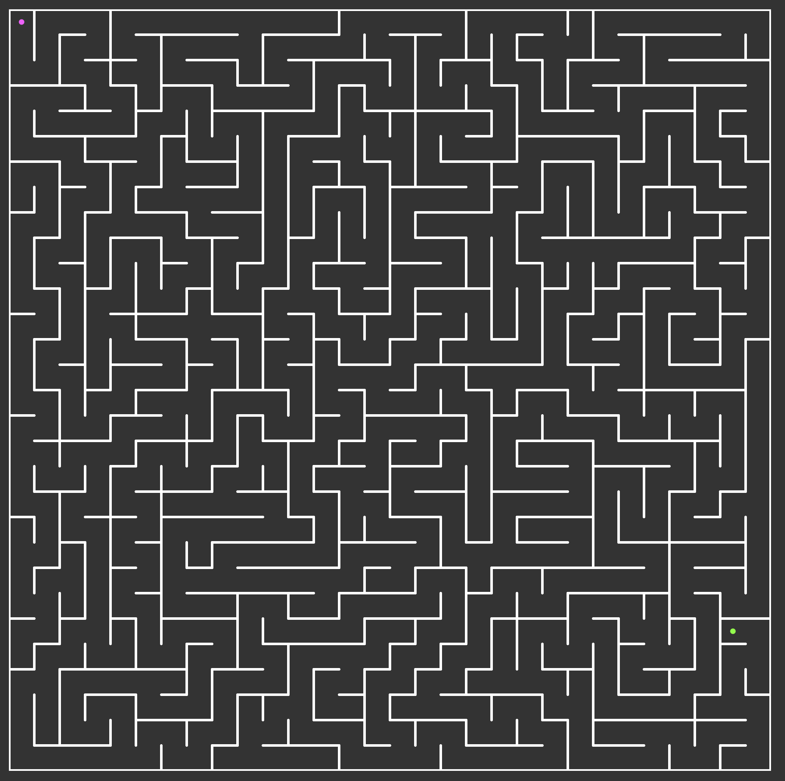

# Maze Racer

Maze Racer is a TypeScript and Next.js maze game that is growing into a
competitive maze community.

The long-term goal is a shared **Maze of the Day**: one maze, available to
everyone in the world, with players competing to earn the title of Maze Master
for that challenge. A backend will store the maze catalog and competition
results, using each maze's compact hexadecimal representation as its canonical
identity.

The community competition and backend are still in development. The repository
currently contains the maze generator, player controls, animation, codec, and a
developer debug page.

## Engineering Highlights

- **Canonical MazeCodec** — serializes an entire generated maze into a compact,
  versioned hexadecimal identity suitable for URLs and database keys.
- **Presentation-independent coordinates** — maze identity uses zero-based grid
  coordinates rather than SVG pixels, so changing visual spacing does not
  change the maze.
- **Deterministic round trips** — encoded mazes reconstruct the same topology,
  start, and destination, with tests protecting codec invariants.
- **Multiple generation algorithms** — depth-first search, randomized Prim, and
  Eller engines share the same inputs and outputs.
- **Interactive SVG gameplay** — keyboard controls, wall collision detection,
  and GSAP-powered player and completion animations.
- **Modern TypeScript stack** — Next.js App Router, Turbopack, and Vitest.

## Run the debug page locally

The debug page is the fastest way for contributors to generate mazes, exercise
the different algorithms, and inspect encoded maze data.

### Requirements

- [Git](https://git-scm.com/)
- Node.js 20.9 or newer
- npm (included with Node.js)

No database, API keys, or environment variables are currently required.

### 1. Download the repository

Clone it with HTTPS:

```bash
git clone https://github.com/NateMarder/Maze-Racer.git
cd Maze-Racer
```

Alternatively, choose **Code → Download ZIP** on the GitHub repository, extract
the archive, and open a terminal in the extracted `Maze-Racer` directory.

### 2. Install dependencies

```bash
npm install
```

### 3. Start the development server

```bash
npm run dev
```

Open [http://localhost:3000/debug](http://localhost:3000/debug) in a browser. If
port 3000 is unavailable, use the local URL printed by Next.js and append
`/debug`.

Stop the development server with <kbd>Ctrl</kbd>+<kbd>C</kbd>.

### Using the debug page

- Move the player with the arrow keys or <kbd>W</kbd>, <kbd>A</kbd>,
  <kbd>S</kbd>, and <kbd>D</kbd>.
- Refresh the page to generate another maze. The page randomly selects DFS,
  Prim, or Eller generation and displays the selected algorithm.
- Select **encode** to place the current maze data in the browser URL.
- Select **decode** to reconstruct a maze from the encoded URL parameters.
- Select **refresh** to clear encoded parameters and generate a fresh maze.
- Select **print state** and open the browser developer console to inspect the
  current `MazeState`.

## Useful development commands

```bash
npm run dev            # Start the local development server
npm run test:run       # Run the test suite once
npm run test:coverage  # Run tests and generate a coverage report
npm run lint           # Check the code with ESLint
npm run build          # Create a production build
npm run start          # Run an existing production build
```

## Maze generation

The project currently supports three perfect-maze generators:

- Depth-first search — long, winding corridors and shorter dead ends
- Randomized Prim — many short branches and frequent turns
- Eller — row-by-row generation with horizontal and vertical set merging

Each generator accepts the same `MazeState` input and returns the wall keys to
remove plus the destination node farthest from the start.

## MazeCodec

MazeCodec serializes a generated maze into a versioned canonical identifier
that can be embedded in a URL. The decoder reconstructs the same maze from that
data, allowing deterministic sharing without requiring server-side persistence.
This representation is also the foundation for the planned Maze of the Day
catalog.



The canonical identifier for this maze is:

```text
v1:4x4:69a9dc28:start=0,0:end=0,3
```

| Segment | Meaning |
| --- | --- |
| `v1` | Canonical format version |
| `4x4` | Column and row count |
| `69a9dc28` | Hexadecimal maze topology |
| `start=0,0` | Zero-based logical start coordinate |
| `end=0,3` | Zero-based logical destination coordinate |

Logical coordinates make maze identity independent of SVG dimensions and node
spacing. Presentation settings such as `spacing`, along with game metadata such
as `level`, travel separately in the URL and are not part of the canonical
identifier. Existing unversioned maze URLs remain readable and are migrated to
v1 the next time they are encoded.

## Current features

- Procedural maze generation using multiple graph algorithms
- Compact URL-safe maze encoding and deterministic decoding
- GSAP-powered player and completion animations
- Keyboard navigation with wall collision detection
- Round-trip codec and engine invariant tests with Vitest
- Next.js App Router and Turbopack development

## Screenshot



## Project direction

The planned community experience includes:

- One shared Maze of the Day challenge
- A persistent database of encoded mazes
- Timed global competition on identical maze layouts
- Daily results and recognition for each maze's Maze Master

Ideas, bug reports, and contributions that move the project toward that
experience are welcome.
