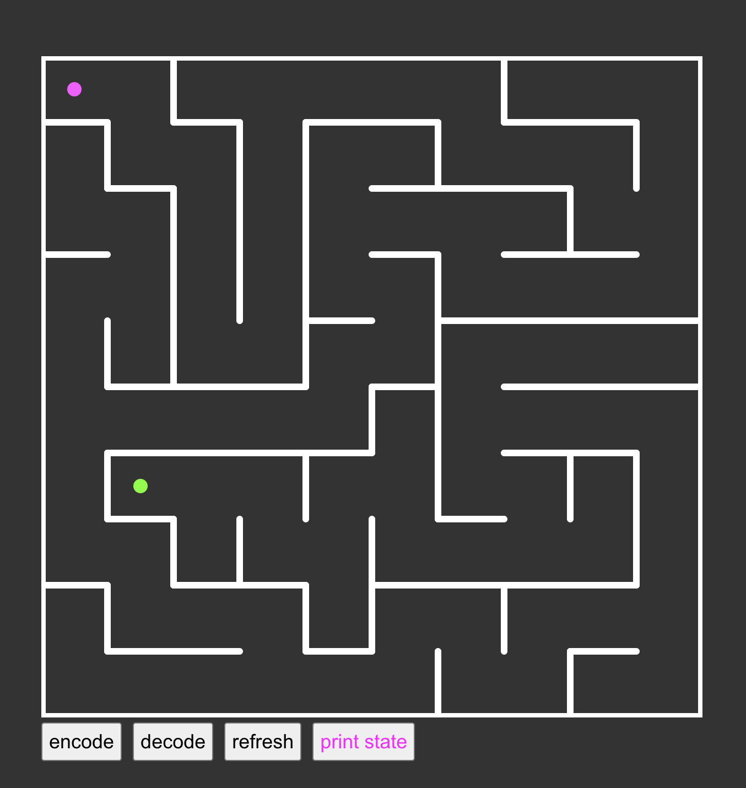

# Maze Racer

A modern TypeScript / Next.js implementation of a procedurally generated maze game.

## Engineering Highlights
- MazeCodec API with 100% deterministic serialization and compression algorithms made from scratch
- Random maze generation
- User-Control via GSAP animations
- UI supported by React

## Features

- 🧩 Random maze generation using graph algorithms
- 📦 Custom MazeCodec that serializes an entire maze into a compact hexadecimal URL
- 🔄 Deterministic encode/decode with round-trip tests
- ⚡ GSAP-powered animations
- 🧪 Vitest unit tests protecting codec invariants

## Screenshots

