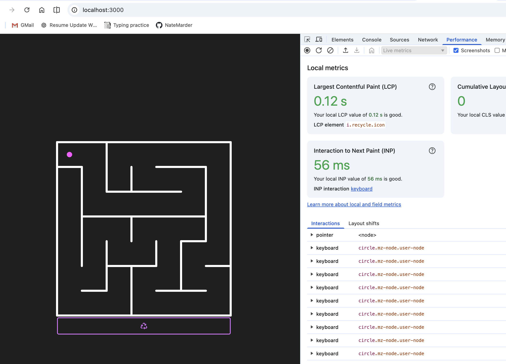
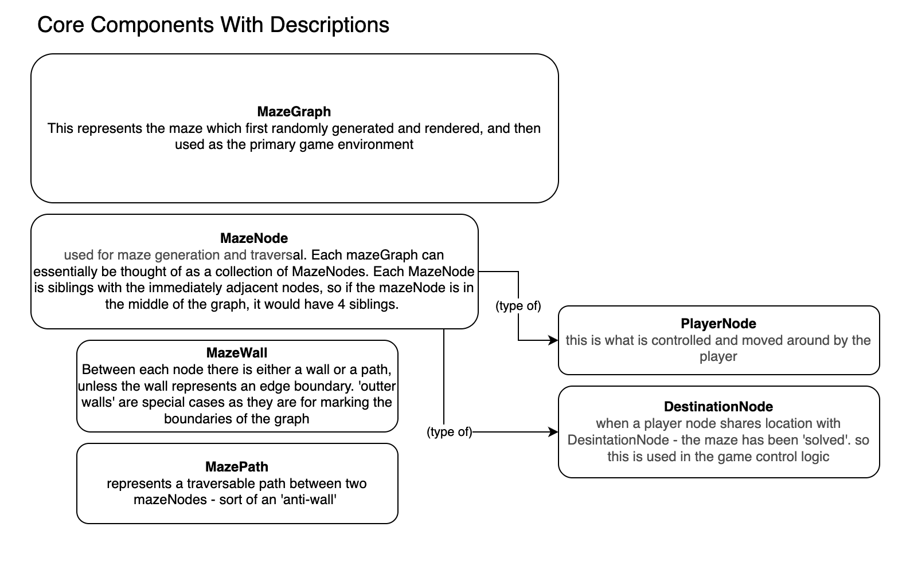

 # Ticket 1: Project Archaeology

## Tasks
1. [X] Run the existing application locally.
2. [X] Remove obviously dead files and dependencies.
3. [X] Create a simple diagram showing:
    - a) React component hierarchy
    - b) Where maze generation occurs
    - c) Where player movement occurs
    - d) Where rendering occurs
4. [X] Identify any global state.
5. [X] Identify any components that re-render during movement.
6. [X] Commit as:  
   `chore: clean up legacy project`

## Notes from EM
- Don't touch functionality yet
- This ticket is about understanding

---
## Task Results: 

### Running Locally
`Geting the project to actually run locally required a few library updates. package.json was updated accordingly`


### Removal of files
- src/SwipeContext.js (used for handling swipes, but he library was ancient and over-complicating things for now)
- src/contexts/index.js (not used)
- src/mazeSolvers/dijkstra.js (not used)
- src/components/GameContainer (unnecessary extra layer)


### The Simple Diagram


#### Rendering / Maze Generation
- Maze Rendering - occurs in the file called 'levelOne'. This maze rendering is done by executing as a DFS algorithm on the maze graph. Currently, the size of the graph is determined by the size of the window, so as the page loads, the parameters are determined, then the maze-graph with 100% walls and no paths is created, then the DFS algorithm 'carves' the paths untill all nodes are discovered.
- A quick look at the MazeGraph.jsx file reveals how the peices fit together:
- ```javascript
      <div ref={this.mazeGraphRef}>
        <svg width={width} height={height} id="mz-svg">
          {this.getOutterWalls()}
          {this.getInnerWalls()}
          {this.getUserControlNode()}
          <DestinationNode
            x={destNodeX}
            y={destNodeY}
            r={Math.round(DEFAULTS.desktopSpacing * 0.10)}
          />
        </svg>
      </div>
  ```
- The 'desination node' is what the player is racing towards. As each path is carved out within the levelOne DFS alogrithm, we keep track of how far away each node is from the players original position, which will always be the top left. The node with the furthest distance from the player node is what is used as for the positioning of the destination node. This game logic is currently hard-coded into the game generation.

#### Player Movement Loop
- this is controlled in the PlayerNode file. The listeners and the logic to determine what happens when different keys are hit are controlled in the this file. There is really one obvious 'loop' but upon each keystroke, we determine if that movement is possible and if so, we animate the motion and update the player node's state.
- one fancy thing to keep in mind regarding player movement - is that the node will keep moving in the same direction until either it hits a wall or the player presses an arrow. this keeps things snappy and prevents the player from having to hit the keys a zillion times
- current memory profiling in google chrome reveals this is actually extremely performant right now, which is good.


### Global State
- not very much is kept in global state right now - only the player position and destination position. When these match, the game is over
- currently we don't keep scores

### Re-Rendering
- only the player node is re-rendered currently which makes this all work
- since we are using extemely simple light-weight svg images, we can scale the maze and control-nodes to any size needed, depending on the window size, but this all happens as the page loads. 