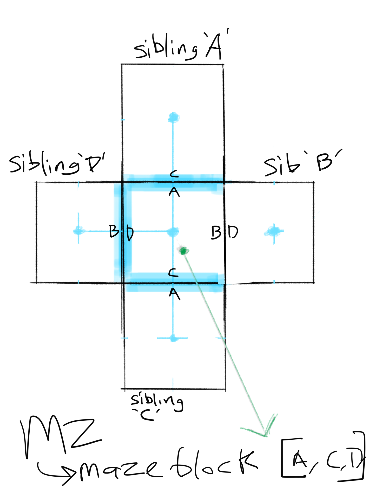

# Ticket #005 — Reintegrate Maze Serialization

> Goal: Understand and restore the compression algorithm without changing behavior.

## Acceptance Criteria
 - [1] Locate compressionHandler.js.
 - [2] Document the current encode/decode flow.
 - [3] Identify exactly what gets serialized:
    - rows / cols?
    - wall presence?
    - excluded walls?
    - start / destination?
    - version info?
 - [4] Add one known-good example:
    - maze state in
    - hex string out
 - [5] decoded maze matches expected shape
 - [6] Avoid major refactoring until we have a passing test or reproducible console check.


```
// add a script that does this successfully
const encoded = encodeMaze(mazeState);
const decoded = decodeMaze(encoded);

console.log({ encoded, decoded });
```


## Compression Documentation

### 1: Locate compressionHandler.js

> src/mazeCodec/compressionHandler.js

### 2: Document the current encode/decode flow

#### encode flow

The following execution sequence builds the 'shareLink' using a maze object,
which is typed as a MazeGraph (past nate started to convert this to typescript)
```typescript
    this.maze = maze;
    this.ensureNodesHavePathDirections( this.maze );
    this.hex = this.exportNodesAsHex( this.maze );
    this.shareLink = this.constructUrlFromCurrentMazeData();
    history.pushState( null, null, this.shareLink );
```

lets break this down more... starting with 'ensureNodesHavePathDirections'
```typescript
    // this function is intentionally mutating it's input param (face-palm).
    // the functionality is crucial though as it basically analysizes the sibling 
    // keys to figure out how the maze-path is moves through each maze node. 
    // these 'directions' are actually just enums representing just 2 directions... at first glance the reader may be thinking "but aren't there 4 possible directions?" ....yes! since neiboring mazenodes share walls, we only need to worry about wither there is a path going RIGHT or DOWN (since we starting iterating through the nodes from the top left). 
    function ensureNodesHavePathDirections( maze: MazeGraph ): void {
        const nodeKeys = Object.keys( maze.nodes ).sort();
        for ( let n of nodeKeys ) {
            maze.nodes[n].transformSiblingKeysToDirections();
        }
    }


    // this function iterates through our maze-nodes from top left to bottom right, moving along 2 nodes at time. We could do one node, but this would represent extra work, as maze-nodes share walls
    private exportNodesAsHex( maze: MazeGraph ): string {

        let hx = "";
        const nodeKeys = Object.keys( maze.nodes ).sort();
        for ( let i = 0; i < nodeKeys.length - 1; i += 2 ) {
            let binary = "";
            const node1Paths = maze.nodes[nodeKeys[i]].pathDirections;
            const node2Paths = maze.nodes[nodeKeys[i + 1]].pathDirections;

            binary += node1Paths.indexOf( directions.Right ) > -1 ? "1" : "0";
            binary += node1Paths.indexOf( directions.Down ) > -1 ? "1" : "0";
            binary += node2Paths.indexOf( directions.Right ) > -1 ? "1" : "0";
            binary += node2Paths.indexOf( directions.Down ) > -1 ? "1" : "0";
            const numberVal = parseInt( binary, 2 );
            hx += getHexFromDecimalString( numberVal );
        }
        return hx;
    }

    // here is what the directions look like
    export const directions = {
        Up: 0,      // [0,0,0,0]
        Right: 1,   // [0,0,0,1]
        Down: 2,    // [0,0,1,0]
        Left: 3,    // [0,0,1,1]
    };
```


